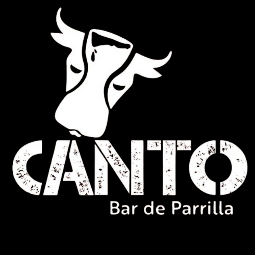

# Link Bio - Canto Bar de Parrilla



## 🔗 Sobre

Link bio moderno e responsivo para o Canto Bar de Parrilla, restaurante especializado em autêntica parrilla uruguaia e argentina localizado em Curitiba.

## ✨ Características

- 🎨 **Design Moderno**: Interface escura com elementos dourados (#FFD700) e vinho (#943742)
- 📱 **Totalmente Responsivo**: Otimizado para todos os dispositivos
- 🚀 **Performance**: HTML puro, sem dependências externas pesadas
- 📊 **Analytics Ready**: Eventos dataLayer configurados para Google Tag Manager
- ♿ **Acessível**: Implementado com aria-labels e boas práticas
- 🎬 **Animações Suaves**: Entrada elegante dos elementos

## 🛠️ Tecnologias

- HTML5
- CSS3 (com animações)
- JavaScript Vanilla
- Font Awesome 6.5.1
- Google Fonts (Poppins)

## 📋 Funcionalidades

### Botões de Ação
- 🍽️ Cardápio completo
- 📃 Menu de almoço
- 📅 Sistema de reservas
- 💬 WhatsApp direto

### Informações
- 📍 Endereço completo
- 🕐 Horários de funcionamento

### Redes Sociais
- Instagram
- TikTok
- YouTube
- LinkedIn
- Facebook
- Google Maps

## 📊 Tracking

Todos os cliques geram eventos no dataLayer:
```javascript
{
  'event': 'lead',
  'event_category': 'Link Bio',
  'event_action': 'Click',
  'event_label': '[Nome do Botão]'
}
```

## 🚀 Como Usar

1. Clone o repositório
2. Adicione a logo.jpg no diretório raiz
3. Configure o Google Tag Manager (opcional)
4. Hospede os arquivos no servidor

## 📱 Responsividade

- Desktop: Layout completo com todos os elementos
- Mobile (<768px): Ajustes de tamanho e espaçamento

## 🎨 Cores

- Fundo: #000000 (preto)
- Texto: #FFFFFF (branco)
- Destaque: #FFD700 (dourado)
- Botões: #943742 (vinho)
- WhatsApp: #25D366 (verde)

## 📝 Licença

© 2025 Canto Bar de Parrilla. Todos os direitos reservados.

---

🤖 Desenvolvido com [Claude Code](https://claude.ai/code)